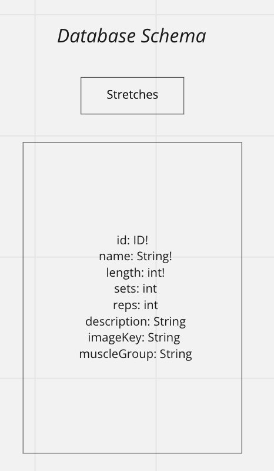

# rePose

**Authors**:

## Overview

rePose is a convenient android application made for the busy professionals of today's modern world. rePose stores several pre-built stretching routines comprised of time-efficient, muscle-targeted stretches to help get your blood flowing. rePose offers users the ability to select their needed exercise and provides a countdown timer to allow users to know how long they've been stretching.

### Why rePose?
Approximately [11% to 40%](https://www.thegoodbody.com/chronic-pain-statistics/) of US adults are living with chronic pain - 60 million people suffer worldwide - with many claiming low back pain.

Importantly, the US and US businesses lose an average of about $322 billion a year due to missed days of work that are tied to chronic pain.

Perhaps most importantly, 85% of patients with chronic pain are affected by severe depression.

### How to Deal with It

A wide range of prescriptions often come from doctors these days to deal with chronic pain. About 20% of chronic pain patients who visit a physician receive an opioid prescription, despite research showing it does not improve quality of life. Online resources like WebMD recommend exercise and [cutting out stress, alcohol, and smoking](https://www.webmd.com/pain-management/guide/11-tips-for-living-with-chronic-pain) when possible. The Mayo Clinic Health System offers advice that rePose's developers believed in: [Stretch, practice good posture and move gently](https://www.mayoclinichealthsystem.org/hometown-health/speaking-of-health/8-tips-for-managing-chronic-pain)

We wanted to be a part of the solution through giving our users the ability to thoughtlessly, but actively, contribute to their recovery and overall health through full-body static stretches.

**Version**: 1.0.0

[comment]: <> ([Active Site]&#40;https://employmee-401.herokuapp.com/&#41; add actual heroku link if needed)

## Architecture
<!-- Provide a detailed description of the application design. What technologies (languages, libraries, etc) you're using, and any other relevant design information. -->

## Wireframing

### 1. Sign Up

### 2. Login

### 3. Home

### 4. Routines

### 5. Stretch

### 6. Finished!

## User Stories

- As a user, I want a simple layout that displays the variety of stretches that are available to me, so that I can choose the muscle group I would like to work on.
- As a user, I want a timer that keeps track of the duration for my stretches, so that I can focus on my breathing while during my stretches.
- As a user, I would like to be notified by a sound queue to let me know that my stretch is ending, so that I can prepare to set up for the next stretch.
- As a user, I would like to have a few seconds in between stretches, so that I can rest and relax for a few seconds before the next stretch
- As a user, I would like to keep track of my sets and reps, so that I know how many sets and reps I have left.

## Domain Modeling

## Database Schema

## Other

- [Team Agreement](./TeamAgreement.md)
- [Requirements](./requirements.md)

## Credit and Collaborations
<!-- Give credit (and a link) to other people or resources that helped you build this application. -->
- [Miro](https://miro.com/) for initial wireframing.
- [Trello](https://trello.com/) for project management.
- [Canva](https://www.canva.com/) for logo design.
- [Stack Overflow](https://stackoverflow.com/) for the struggles.
- [Code Fellows Code 401 Class Repo](https://github.com/codefellows/seattle-java-401d11) for general guidance.